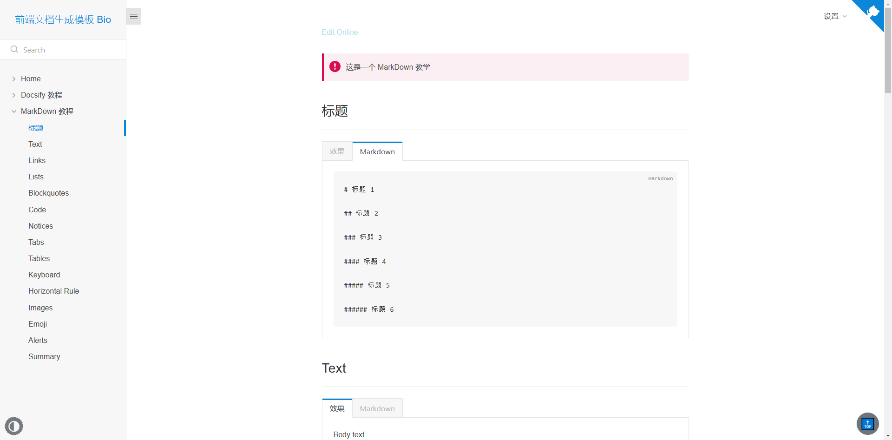
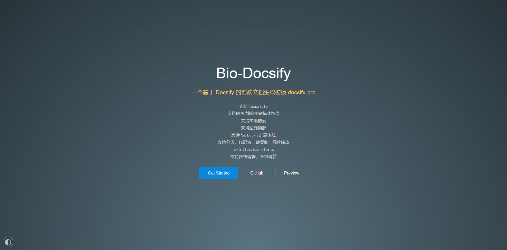

# Bio Docsify

## 介绍 Introduction

> 基于 Docsify 的前端文档生成模板

## 功能 Feature

* 支持 `themeable`
* 支持暗黑/简约主题模式切换
* 支持本地搜索
* 支持回到顶部
* 支持 `Markdown` 扩展语法
* 支持分页、代码块一键复制、图片缩放
* 支持 `flexible-alerts`
* 支持在线编辑、外链跳转

## 预览 Preview

### Light

### Dark

