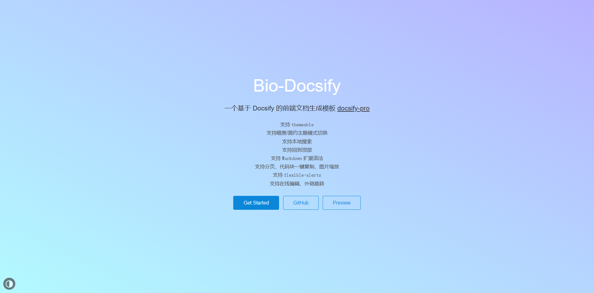
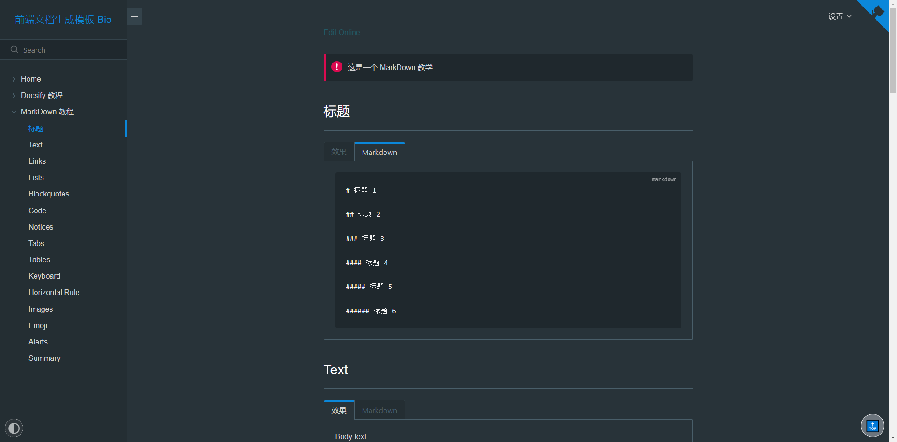

# Bio Docsify

## 介绍 Introduction

> 基于 Docsify 的前端文档生成模板

## 功能 Feature

* 支持 `themeable`
* 支持暗黑/简约主题模式切换
* 支持本地搜索
* 支持回到顶部
* 支持 `Markdown` 扩展语法
* 支持分页、代码块一键复制、图片缩放
* 支持 `flexible-alerts`
* 支持在线编辑、外链跳转

## 预览 Preview

> [Demo Preview](http://bio.biugle.cn)

### Use

* `/source/` 此目录为静态文档根目录，一般只需编辑此目录内容即可，其他均为预设主题代码。

### Light

### Dark

### 碎碎念

> ***文档应该是易用的、方便的，所以我们拒绝需要复杂构建和开发的模板，使用开箱即用的 `docsify` 构建，还支持在线编辑，方便大家共创与维护。***

